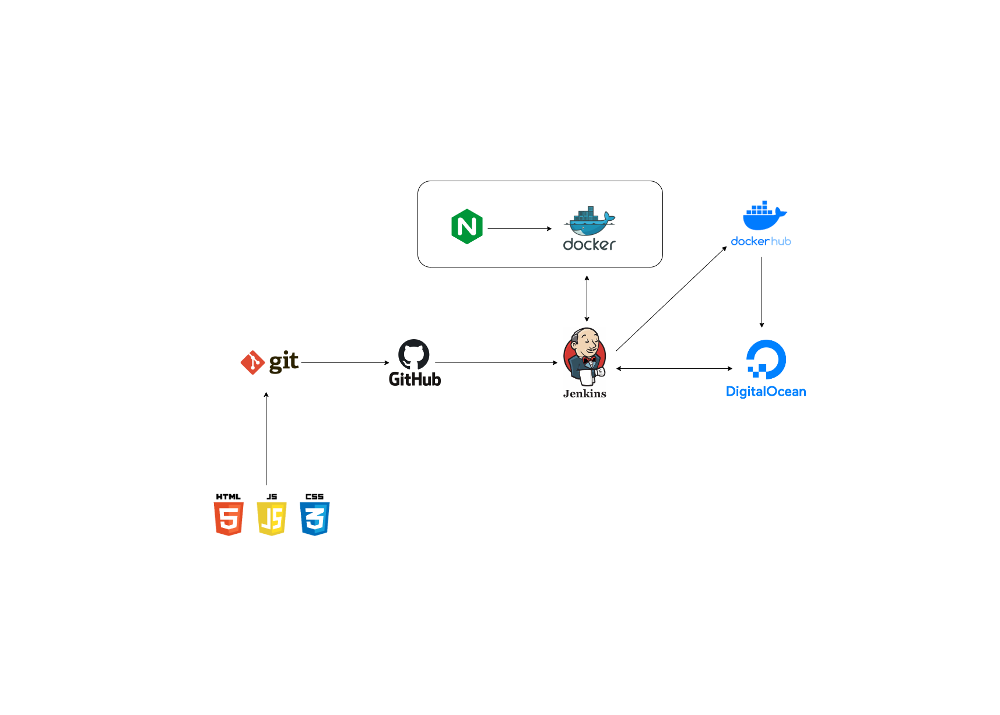

# Continuous Integration and Continuous Deployment (CI/CD) Pipeline for a Web Application

# You can access this website at http://137.184.23.94/

# Project Overview



## Introduction

Continuous Integration and Continuous Deployment (CI/CD) is a software development practice that involves automatically building, testing, and deploying code changes to production. This ensures that changes are integrated and deployed quickly and with high quality, reducing the risk of bugs and downtime.

In this guide, we will walk through the process of setting up a CI/CD pipeline for a web application, using popular tools such as Jenkins and Git.

Prerequisites

1. A source code repository for your web application (e.g., GitHub, GitLab, Bitbucket)
2. A web server to host your application (e.g., DigitalOcean Droplet, Amazon Web Services)
3. We need two servers or droplets one for jenkins and one for production server in which we will deploy our application
4. Some basic knowledge of Linux and Git
5. Patience

## Step 1: Set up Source Code Repository

The first step in setting up a CI/CD pipeline is to store your source code in a repository. This will allow you to manage and track changes to your code over time.

If you haven't already, create a repository for your web application in a Git-based repository management platform, such as GitHub or GitLab. Make sure to push your latest code changes to the repository.

```bash
# fork this repository and clone it to your local machine
git clone https://github.com/ankitraz/minor-project
```

## Step 2: Setup Jenkins and Docker on DigitalOcean Droplet

Next, you'll need to install and configure Jenkins on a build agent machine. Jenkins is an open-source automation server that can be used to automate various parts of the software development lifecycle, including building, testing, and deploying code.

To install Jenkins, follow the instructions in the Jenkins documentation for your operating system. After Jenkins is installed, you'll need to configure it to access your source code repository. This can typically be done through the Jenkins web interface.

* For provisioning servers, We will use Terraform module for digital ocean. Ensure that you have terraform installed on your local machine. You can download it from [here](https://www.terraform.io/downloads.html)

```bash
# clone the repository and follow the instructions in the README
https://github.com/ankitraz/terraform-do
```


## Step 3: Create a Jenkins Job

A Jenkins job is a unit of work that Jenkins can perform. To create a job for our web application, follow these steps:

1. Log in to the Jenkins web interface.
2. Click on "New Item" in the left-hand menu.
3. Enter a name for your job and select "Pipeline" as the type.
4. Enter git repository url in the "Pipeline" section and provide credentials if required.
5. Make sure to give proper access to jenkins to retrieve the code from the repository. (use ssh authentication)
   
   ### Jenkins steps 
   1. Install all required plugins  - generic webhook, ssh agent
   2. create a pipeline job
   3. copy the repository(ssh) url and paste it inside jenkins pipeline settings
   4. Add a new ssh key credential
   	1. first create an ssh key inside jenkins container using `ssh-keygen -t ed25519 -C "your_email@example.com"`
   	2. Now, add jenkins private key to `jenkins-private-key` credential
   	3. Add jenkins public key to Your github
   	4. Login to jenkins container as jenkins user and test the ssh connection between jenkins and github, ( this is important to add github to known_hosts manually)using `ssh -T git@github.com`

   5. Now log on to deployment-server as root user and go to `.ssh` folder
   6. Create `authorized_keys` file inside (it if not exist) and add jenkins public key there (this will allow jenkins to ssh into deployment server and run deploy stage).
   7.  Done.

   ### Credentials required to set in jenkins
   1. jenkins_private_key
   2.  dockerhub-id-pass


## Step 4: Automate the Pipeline

With the Jenkins job created, the next step is to automate the pipeline. This can be done by setting up triggers in your source code repository.

For example, in GitHub, you can set up a webhook that will trigger the Jenkins job whenever changes are pushed to the master branch of the repository.

To set up a webhook, follow these steps:

1. Log in to your source code repository management platform.
2. Go to the settings for your repository.
3. Select "Webhooks" or a similar option.
4. Click "Add webhook".
5. Enter the URL for the Jenkins webhook. This will typically be in the format http://<JENKINS_URL>/github-webhook/.
6. Select the events that should trigger the webhook, such as "Push".
7. Save the webhook.
8. With the webhook set up, the Jenkins job will run automatically whenever changes are pushed to the master branch of the repository.

   ### Steps to trigger build automatically
   1. install generic webhook plugin
   2. go to configure option of pipelin
   3. Under the Build Triggers menu, tick `"Generic Webhook Trigger"` and paste `"githubtoken"` (you can use any) and copy this format `http://JENKINS_URL/generic-webhook-trigger/invoke?token=YOUR_TOKEN`
   4. now go to github repository webhook setting and add a new webhook
   6. paste the copied url inside payload URL
   7. Done

## Step 5: Deploy to a Web Server

The final step in setting up the CI/CD pipeline is to deploy the code to a web server. This can be done using various tools, such as Ansible, Chef, or Puppet.

In the example pipeline script above, the deployment step is performed using a shell script deploy.sh. You'll need to modify this script to perform the specific deployment steps required for your application.

## Conclusion

With a CI/CD pipeline in place, you can ensure that changes to your web application are integrated and deployed quickly and with high quality. By automating the build, test, and deployment process, you can reduce the risk of bugs and downtime and improve the overall stability of your application.